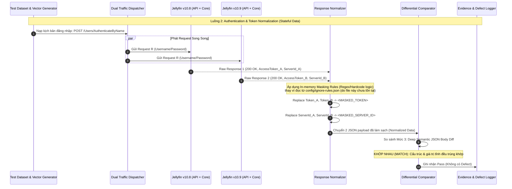

# Sơ đồ 2: Authentication & Token Normalization

**Mô tả:** Sơ đồ này làm rõ vai trò tối quan trọng của thành phần Normalizer. Nhờ áp dụng In-memory Masking Rules, các tham số biến động như AccessToken và ServerId được che đi trước khi thực hiện đối chiếu sâu (Mức 3).

