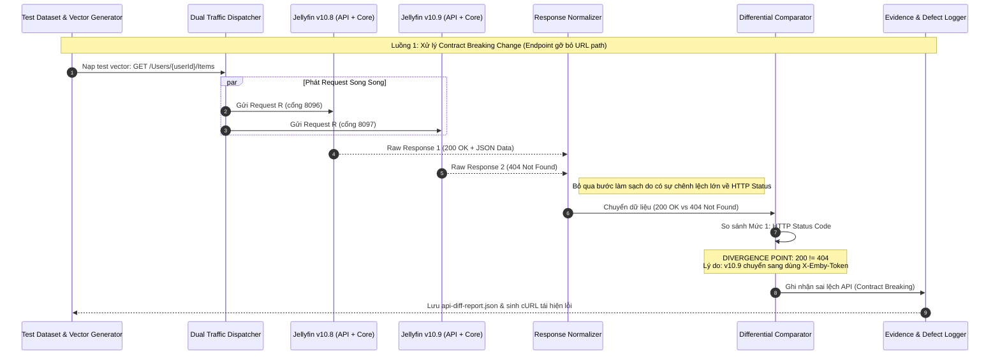

# Sơ đồ 1: Breaking Change (Lỗi gỡ bỏ tham số URL)

**Mô tả:** Sơ đồ này minh họa luồng kiểm thử một API đã bị thay đổi kiến trúc ở phiên bản mới (gỡ bỏ `{userId}` trên URL), dẫn đến sai lệch ngay từ cấp độ HTTP Status Code (Mức 1).

