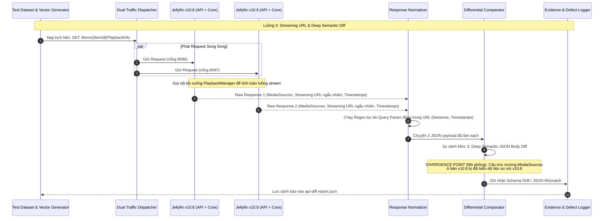

# Sơ đồ 3: Dynamic Logic & Semantic Diff

**Mô tả:** Luồng phức tạp nhất nơi các thành phần nội tại gọi nhau để tính toán Streaming URL. Bộ Normalizer phải dùng Regex phức tạp để xóa các query params biến động, và Comparator phải phân tích sâu để tìm Schema Drift.

